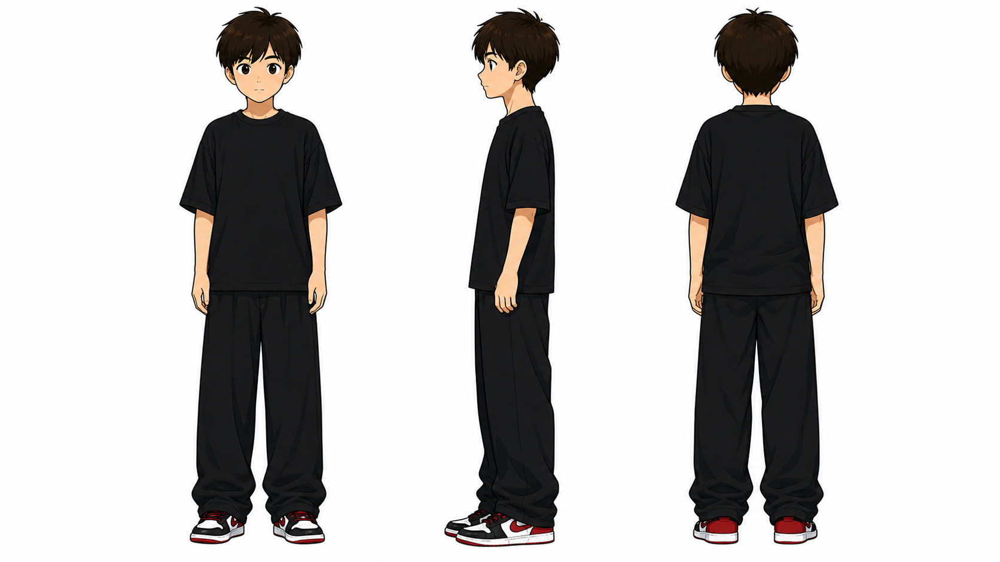

# 鹿小鸣个人 IP 怪诞正文配图 Skill

> 把中文文章里的判断、流程、状态和隐喻，变成角色统一、白底留白、怪诞但清楚的 16:9 手绘配图。

本项目是 [helloianneo/ian-xiaohei-illustrations](https://github.com/helloianneo/ian-xiaohei-illustrations) 的个人 IP 改造版本，保留原项目的视觉 DNA、构图引擎和 MIT 许可，并把默认角色替换为“鹿小鸣”。

## 这不是改名字

稳定个人 IP 的核心是一条可复用规则链：

```text
外形锚点 → 性格锚点 → 职业动作 → 场景映射 → 禁忌 → 三视图 → 八图校准 → QA
```

鹿小鸣的固定锚点是：深棕蓬松短发、棕色大眼、黑色宽松 T 恤和长裤、红黑白球鞋。角色定位是安静、认真、略带冷幽默的内容拆解者；核心动作从旧角色的“拉线/变漏斗”改为画分镜、拆案例、写文案、贴证据、修结构和校验输出。

## 最小改造面

迁移到另一个个人 IP 时，核心只需调整四个文件：

1. `ian-xiaohei-illustrations/SKILL.md`：功能定位、触发语义与工作流。
2. `ian-xiaohei-illustrations/references/xiaohei-ip.md`：角色外形、性格、动作、场景映射和禁忌。
3. `ian-xiaohei-illustrations/references/prompt-template.md`：把角色规则注入每张图。
4. `ian-xiaohei-illustrations/references/qa-checklist.md`：把“像不像同一个 IP”变成可检查门槛。

不要默认改 `style-dna.md` 和 `composition-patterns.md`。前者是风格引擎，后者是构图引擎，应该与具体人物解耦。

## 角色三视图



原始角色参考也保存在 `ian-xiaohei-illustrations/assets/ip-reference/`，用于生成时直接锁定身份。

## 八张校准样图

| 场景 | 构图类型 | 核心动作 |
|---|---|---|
| 内容工作台 | Workflow | 拆开、剪短、重组素材 |
| 逻辑维修 | 系统局部 | 查证并修复断裂逻辑 |
| 草稿前后 | 前后对比 | 删除赘词、保留重点 |
| 卡住到想通 | 角色状态 | 观察、重画、想通 |
| 证据承重 | 概念隐喻 | 用证据支撑观点 |
| 方法搭层 | 方法分层 | 从事实向上搭建表达 |
| 选题到发布 | 地图路线 | 校验节点、修正方向 |
| 修改完成 | 小漫画分镜 | 初稿、修改、完成 |

| | |
|---|---|
|  |  |
|  |  |
|  |  |
|  |  |

这些图片只用于校准角色身份、留白、线条密度、动作语法与标签克制程度。生成新图时必须根据当前文章重新发明物理隐喻，禁止照抄样图构图。

## 安装

```bash
git clone https://github.com/luming2026/ian-xiaohei-illustrations.git
mkdir -p "${CODEX_HOME:-$HOME/.codex}/skills"
cp -R ./ian-xiaohei-illustrations/ian-xiaohei-illustrations "${CODEX_HOME:-$HOME/.codex}/skills/"
```

安装后，在 Codex 中使用：

```text
Use $ian-xiaohei-illustrations 为这篇中文文章设计并生成 5 张鹿小鸣个人 IP 风格正文配图。
```

## 目录结构

```text
.
├── LICENSE
├── NOTICE.md
├── README.md
├── examples/
│   ├── images/                 # 8 张校准样图
│   └── prompts.md              # 8 个可复现校准任务
└── ian-xiaohei-illustrations/
    ├── SKILL.md
    ├── agents/openai.yaml
    ├── assets/
    │   ├── ip-reference/       # 原始参考 + 三视图
    │   └── examples/           # Skill 运行时低频校准样图
    └── references/
        ├── style-dna.md
        ├── xiaohei-ip.md
        ├── composition-patterns.md
        ├── prompt-template.md
        └── qa-checklist.md
```

## 许可与署名

代码与 Skill 结构沿用 MIT License。原始项目、视觉方法与“小黑”体系由 [Ian](https://github.com/helloianneo) 创建；本仓库保留上游署名，鹿小鸣角色规则与校准资产为本次衍生改造。
